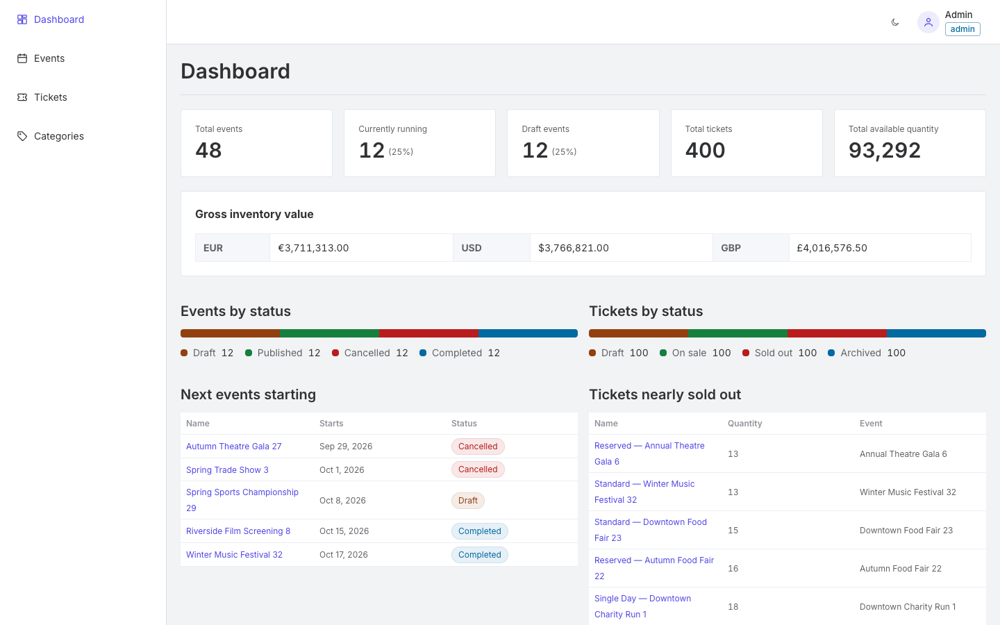
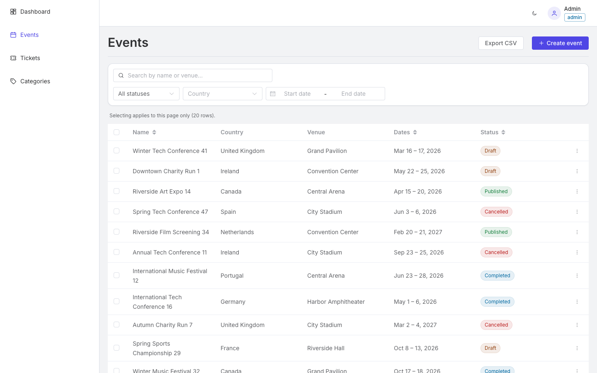
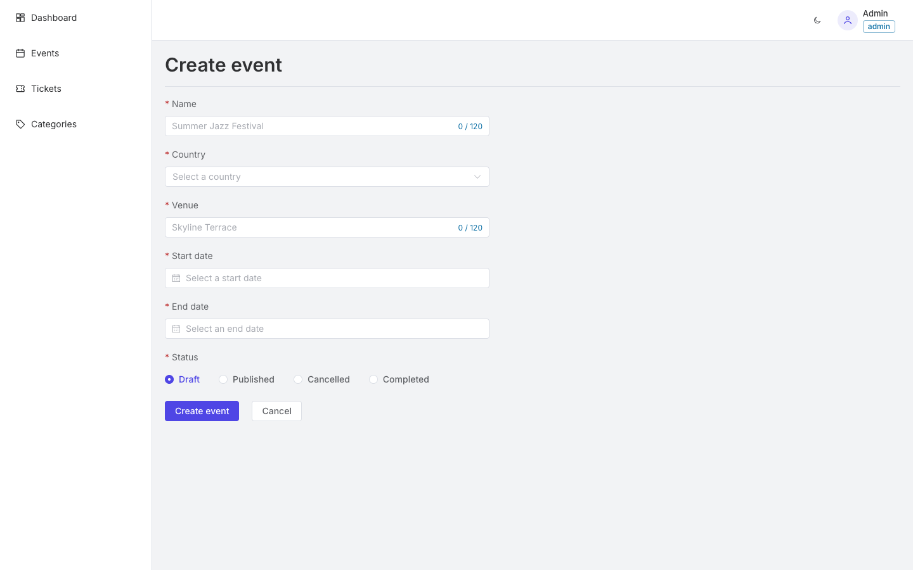
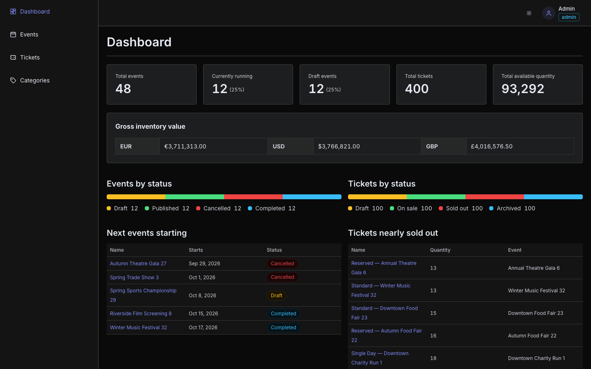
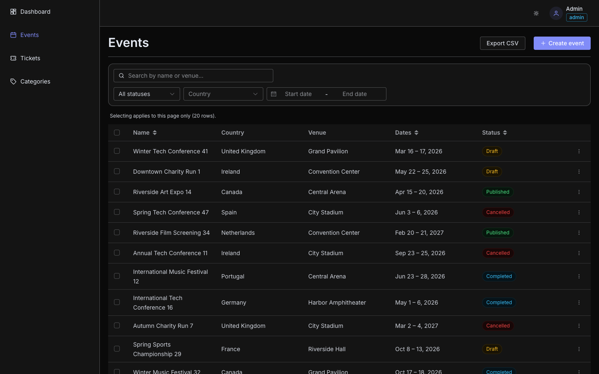
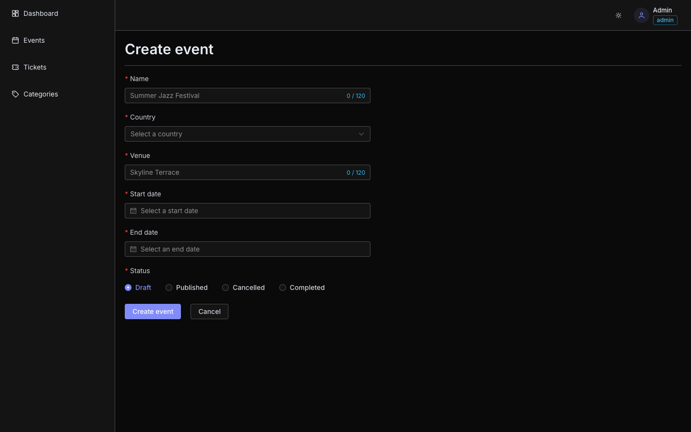
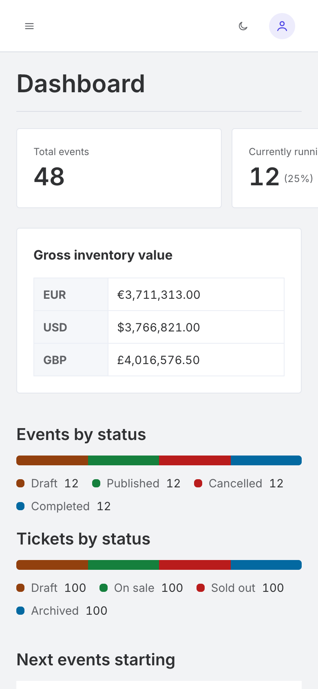
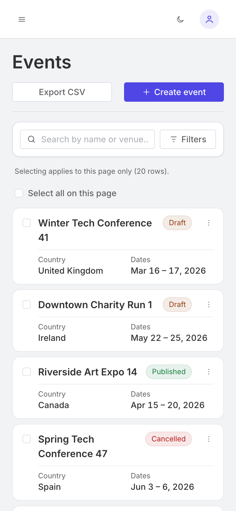
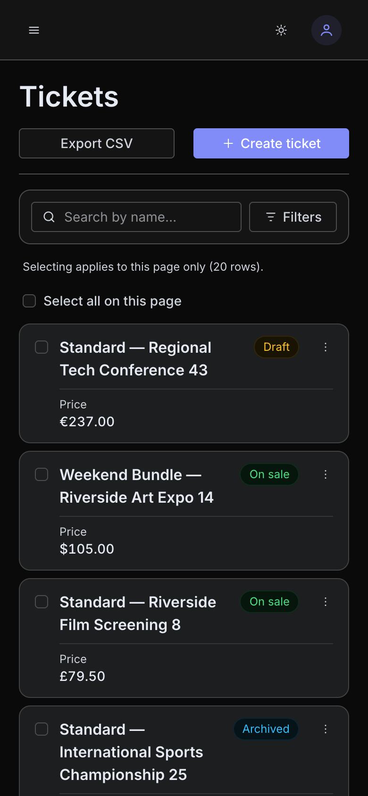
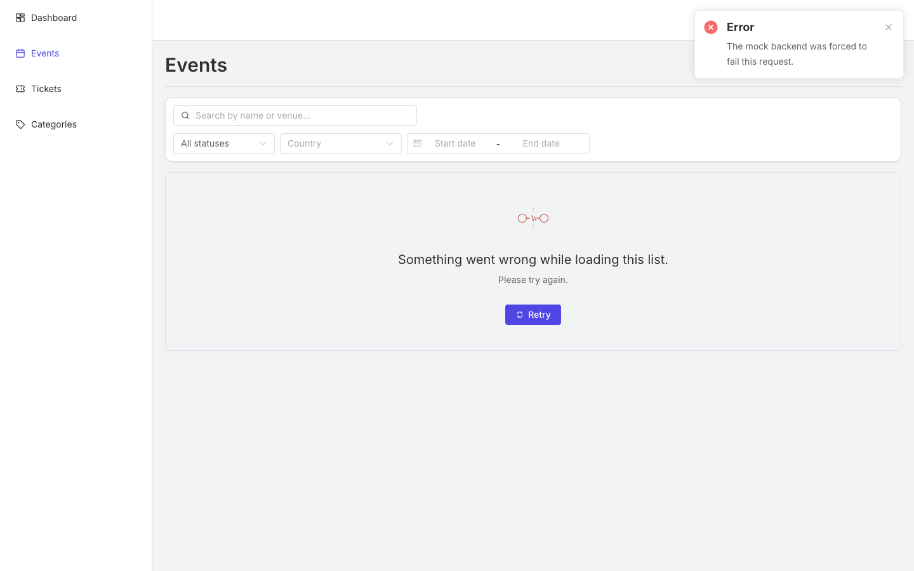

# Ticket Management Admin Portal

An administration portal for managing **Events**, **Ticket Categories** and **Tickets**,
built with Vue 3, TypeScript, Pinia and Element Plus against a fully mocked,
contract-typed backend.

Administrators sign in and then:

- **Dashboard.** See headline statistics, status distributions, gross inventory value per
  currency, the next events starting and the tickets closest to selling out.
- **Lists.** Browse every entity in a searchable, filterable, sortable, paginated table.
  The list state lives in the URL, so a view can be shared, reloaded or restored with the
  back button.
- **CRUD.** Create, edit and delete every entity, with validation, server field errors
  mapped onto the form, and a guard against leaving a form with unsaved changes.
- **Bulk actions.** Delete many rows at once, or archive events and tickets, with a
  per-row result report when some rows fail.
- **CSV export.** Export exactly what the current filter and sort show.
- **Roles.** An administrator can read and write; a viewer is read-only. Permissions are
  enforced by the mock server, the router and the UI.
- **Dark mode and responsive layout.** Everything works on desktop, tablet and mobile, in
  both themes.

| Dashboard | Events list | Event form |
|---|---|---|
|  |  |  |
|  |  |  |

| Mobile | | | Forced API failure |
|---|---|---|---|
|  |  |  |  |

More in [`docs/screenshots/`](docs/screenshots/).

## Quick start (Docker)

The fastest way to run the portal. You need Docker and nothing else, not even Node.

```sh
docker compose up --build
```

Open [http://localhost:8080](http://localhost:8080) and sign in with one of the accounts
below.

## Demo credentials

| Role | Email | Password | Access |
|---|---|---|---|
| **Administrator** | `admin@platinium.test` | `admin123` | Full read and write |
| **Viewer** | `viewer@platinium.test` | `viewer123` | Read-only: write controls are hidden, write routes redirect to a 403 page, and the mock API rejects writes with `403` |

## Local installation

Requires **Node.js `^20.19.0 || >=22.12.0`**. The pinned version is in [`.nvmrc`](.nvmrc).

```sh
nvm use
npm install
npm run dev
```

The dev server prints its URL, which defaults to [http://localhost:5173](http://localhost:5173).
No `.env` file is needed. [`.env.example`](.env.example) documents the two variables the
app reads.

## Commands

### Development

| Command | What it does |
|---|---|
| `npm run dev` | Start the Vite dev server with HMR and the mock API |
| `npm run lint` | ESLint over the whole repository, with autofix |
| `npm run type-check` | Type-check `.ts` and `.vue` files with `vue-tsc` |
| `npm run openapi-generate` | Regenerate `src/features/platform/api/schema.ts` from `src/mocks/openapi.yaml` (runs automatically on `npm install`) |

### Build

| Command | What it does |
|---|---|
| `npm run build` | Type-check, then produce the production bundle in `dist/` |
| `npm run preview` | Serve the production bundle locally. The mock API is off unless you build with `VITE_ENABLE_MOCKS=true` |

### Testing

| Command | What it does |
|---|---|
| `npm run test` | Run the unit and integration suites |
| `npm run test:unit` | Unit suite only: composables, stores, services, utilities and components in isolation |
| `npm run test:integration` | Integration suite only: complete user journeys through the real router, Pinia and the mock API |
| `npm run test:watch` | Watch mode. Pass a path or `-t <name>` to target one file or test |
| `npm run test:coverage` | Both suites with a coverage report in `coverage/`. There is no threshold gate |

The testing strategy, the test kit and where each kind of test belongs are described in
[`TESTING.md`](TESTING.md).

### Docker

| Command | What it does |
|---|---|
| `docker compose up --build` | Build the image and serve the portal on port 8080 |
| `docker compose down` | Stop and remove the container |
| `docker build -t ticket-admin-portal .` | Build the image without compose |
| `docker run --rm -p 8080:80 ticket-admin-portal` | Run that image directly |

The [`Dockerfile`](Dockerfile) is multi-stage:

- **Build stage.** Installs from the lockfile, then type-checks and builds.
- **Runtime stage.** Only nginx and the compiled `dist/`: no source, no `node_modules`
  and no toolchain.

[`nginx.conf`](nginx.conf) sets up three things:

- Unknown paths fall back to `index.html`, so reloading a nested route works.
- Hashed assets are cached as immutable.
- `index.html` and the MSW service worker are always revalidated.

The image is built with `VITE_ENABLE_MOCKS=true` because there is no real backend (see
below). When one exists, build with `--build-arg VITE_ENABLE_MOCKS=false` and set
`VITE_API_URL`.

### Quality gates

| Where | What runs |
|---|---|
| `pre-commit` (Husky + lint-staged) | ESLint on staged files |
| `pre-push` (Husky) | `type-check` and the full test suite |
| CI ([`.github/workflows/ci.yml`](.github/workflows/ci.yml)) | Lint, type-check, both suites with coverage (uploaded as an artifact), then a production build |

## The mock API

There is no server. [MSW](https://mswjs.io) intercepts `fetch` and XHR below axios. In the
browser it runs as a service worker; in tests it runs in Node. Application code therefore
makes real HTTP calls exactly as it would against a real backend, with nothing to branch
on and nothing to remove later.

- **The contract lives in [`src/mocks/openapi.yaml`](src/mocks/openapi.yaml).** Types in
  [`schema.ts`](src/features/platform/api/schema.ts) are generated from it offline, and
  both the API client and the mock handlers are typed against them.
- **It behaves like a server.** Search, filtering, sorting, pagination, uniqueness checks,
  referential integrity (`409` when deleting an event that still has tickets), bulk
  operations, CSV generation, dashboard aggregation and role checks all run in the mock
  ([`src/mocks/db/`](src/mocks/db/), [`src/mocks/handlers/`](src/mocks/handlers/)). The UI
  never receives a full dataset.
- **Seed data is deterministic:** 48 events, 6 categories and 400 tickets, generated from
  a fixed seed.
- **Changes persist** in `localStorage`, so they survive a reload.
- **Every response has about 400 ms of latency**, so loading states are visible.

**To reset the demo data**, run this in the browser console and reload:

```js
localStorage.removeItem('platinum:mock-db')
```

**To force an API failure**, use `window.__mockChaos` in the browser console. Its state
lives in memory, so navigate with the sidebar afterwards; a full reload clears it. Paths
are route patterns such as `/events` or `/events/:id`, not concrete URLs.

```js
__mockChaos.failNextRequest({ path: '/events', status: 500 })     // the next events-list request fails
__mockChaos.failPersistently({ path: '/tickets/:id', status: 409 }) // every ticket read/update/delete fails
__mockChaos.failNextRequest({ path: '/events', status: 401 })     // simulate an expired session
__mockChaos.setLatency(3000)                                       // slow every response down
__mockChaos.clearChaos()                                           // back to normal
```

## Project structure

```
.claude/              AI workflow: project skills, conventions and the path-rules hook
.config/              Vite plugins and ESLint rule sets
  auto-imports/         unplugin-auto-import and unplugin-vue-components setup
  eslint-rules/         base / stylistic / typescript / vue rule sets
  icon-names-generator/ generates the icon-name union from the SVG files
  modals-generator/     registers every *Modal.vue file
  route-names-generator/ generates the routeNames registry from usage
.github/workflows/    CI pipeline
docs/
  prd/                  ten PRDs and the Element Plus component policy
  issues/               the vertical-slice issue specs the PRDs were split into
  screenshots/          README screenshots
  design-system.md      tokens, type scale, motion and status colours
  AI_WORKFLOW.md        how AI was used to build this, with its corrections
dts/                  global type declarations (generated and hand-written)
public/               static files, including the MSW service worker
ralph/                the containerised loop that worked through the issues autonomously
src/
  assets/styles/        global CSS, design tokens, Element Plus theme bridge
  components/           shared components: CurrencyInput, RemoteSelect, StatusTag, …
    data-table/           AppDataTable, ListToolbar, ListFilterField
  composables/          shared composables: list query/resource, bulk ops, CSV, theme, …
  features/platform/    route-agnostic infrastructure
    api/                  axios client, interceptors, generated OpenAPI types
    icons/                <Icon> component and SVG assets
    modals/               modal registry and useModals
  layouts/              AuthLayout, AdminLayout, sidebar, account menu, theme toggle
  mocks/                the mock backend
    db/                   in-memory database, query engine, seed fixtures, persistence
    handlers/             MSW handlers per entity, built from a shared factory
    openapi.yaml          the API contract: the single source of truth
    chaos.ts              forced failures and latency
  plugins/              Vue plugins
  router/               routes, auth and permission guard, generated route names
  services/             global services: auth, notifications
  store/                Pinia stores (auth is the only one)
  types/                application-owned type definitions
  utils/                formatters, countries, status presentation, event emitter
  views/                route-bound pages, one folder per area
    <area>/               page, its routes, service, composables and components
tests/
  integration/          user-journey tests against the real router, Pinia and MSW
  support/              test kit: mount helpers, viewport, session and database seams
  setup.ts              global Vitest setup (MSW server lifecycle)
```

Unit tests sit next to the file they test as `*.spec.ts`.

## Architecture overview

Dependencies point one way only:

```
component  →  composable  →  store  →  service  →  apiClient
```

- **Service.** API and domain calls, one per area (`events.service.ts`, …). Knows nothing
  about stores or composables.
- **Store.** Only for state that is genuinely shared. The auth store is the only one,
  because the guard, the shell and the permission checks all read it. Entity lists are not
  stores.
- **Composable.** The orchestrator. `useListQuery` keeps list state in the URL,
  `useListResource` fetches, cancels superseded requests and recovers from errors, and
  each page composes them.
- **Components** render and emit intent. `AppDataTable` is one descriptor-driven table
  used by all three lists. Below tablet width it switches to cards.

**Views** are route-bound pages. **Features** are reusable, route-agnostic modules and
never import from each other.

Cross-cutting behaviour lives in one place:

- **Errors.** The response interceptor turns `401` into a sign-out, `400` into field errors
  and anything else into a notification.
- **Permissions.** A single `useCapability` composable answers "can this role do this
  operation on this entity?"

The full rules, naming conventions and examples are in [`architecture.md`](architecture.md).

## Technical decisions

| Decision | Why |
|---|---|
| **Local OpenAPI contract** | Types are generated offline and deterministically. The contract and the code cannot drift apart silently, and the Docker build needs no network |
| **MSW with server-side semantics** | App code is identical to production code. The same handlers serve the browser and the tests. The client is shaped for a large dataset from day one |
| **URL-driven list state** | Views can be shared and reloaded, the back button works, and returning from an edit restores the exact list. Debounce, page reset and default omission are implemented once |
| **Money in integer minor units** | No floating-point rounding. Conversion happens in exactly one place, `CurrencyInput` |
| **One configurable table** | Three lists share one set of sorting, selection, loading, empty, error and mobile behaviour |
| **Element Plus first** | Shared components (`AppDataTable`, `ListToolbar`, `StatusTag`, `CurrencyInput`, `RemoteSelect`, `useConfirm`) wrap `el-table`, `el-form`, `el-select`, `el-pagination` and `ElMessageBox` instead of hand-building controls. Theming goes through `--el-*` variables mapped onto the design tokens. See [`ELEMENT-PLUS.md`](docs/prd/ELEMENT-PLUS.md) |
| **Refuse, never cascade** | Deleting an event or category that tickets still reference returns `409` with the blocking count, which the admin sees, instead of silently deleting the tickets |
| **Bulk endpoints with per-row results** | Partial success is reported row by row instead of by N sequential client requests |
| **One aggregate dashboard endpoint** | Statistics are computed where a server would compute them, not reduced in the browser |
| **Tailwind v4 for layout, tokens for colour** | Tailwind and Element Plus read the same CSS variables, so a utility class and a component cannot disagree. See [`docs/design-system.md`](docs/design-system.md) |

The reasoning, the rejected alternatives and the costs are in
[`TECHNICAL_REVIEW.md`](TECHNICAL_REVIEW.md). Each decision was first recorded in the
[PRDs](docs/prd/).

## Assumptions

- **Authentication is mocked.** Two seeded accounts; no registration, password reset or
  token refresh.
- **Dates are whole days** (`YYYY-MM-DD`) and timezone-naive. An event occupies whole
  days.
- **Any status can move to any other.** No transition graph is enforced.
- **Ticket quantity is stock**, not a live sales counter, and status is not derived from
  it.
- **Money is never converted between currencies.** The dashboard shows value per currency
  because a total that mixes euros and pounds is not a number.
- **English only.**

## Trade-offs

- **Session token in `localStorage`** rather than an httpOnly cookie, because there is no
  server to set one.
- **No optimistic updates.** Against a mock with 400 ms latency they would add rollback
  code with no visible benefit.
- **No Playwright suite.** The mock runs in the browser, so a browser-driven suite would
  exercise the same handlers the integration suite already covers.
- **Offset pagination.** Fine at this size; cursor pagination is the path to very large
  datasets.
- **Selection is scoped to the current page** and clears when the query changes, so a bulk
  action can never hit rows the admin cannot see.
- **No request cache.** Lists refetch on every query change and cancel superseded
  requests.

Each item, with its production cost and the condition that would change the answer, is in
[`TECHNICAL_REVIEW.md`](TECHNICAL_REVIEW.md).

## Further reading

| Document | What's in it |
|---|---|
| [`TECHNICAL_REVIEW.md`](TECHNICAL_REVIEW.md) | Decisions, accepted debt, next steps, scaling, team standards, AI |
| [`docs/AI_WORKFLOW.md`](docs/AI_WORKFLOW.md) | How AI was used to build this, including where it went wrong |
| [`architecture.md`](architecture.md) | Layering rules, naming conventions, auto-imports |
| [`TESTING.md`](TESTING.md) | Testing strategy and the test kit |
| [`docs/design-system.md`](docs/design-system.md) | Tokens, typography, motion and the Element Plus theme bridge |
| [`docs/prd/ELEMENT-PLUS.md`](docs/prd/ELEMENT-PLUS.md) | Element Plus component policy and component map |
| [`docs/prd/`](docs/prd/) · [`docs/issues/`](docs/issues/) | The specifications this was built from |
