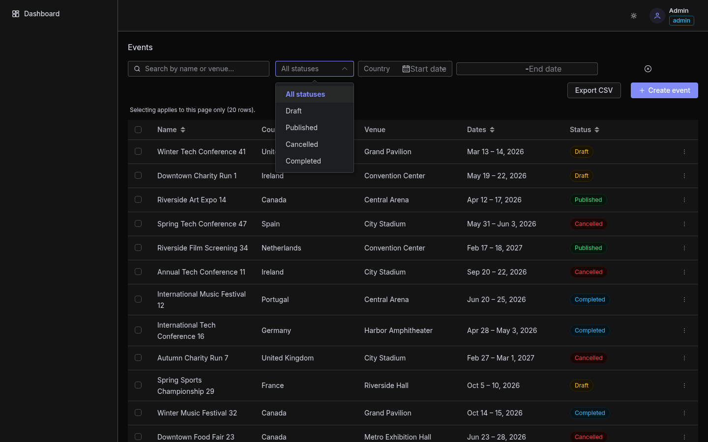
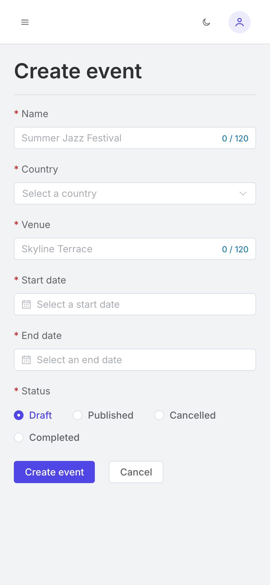
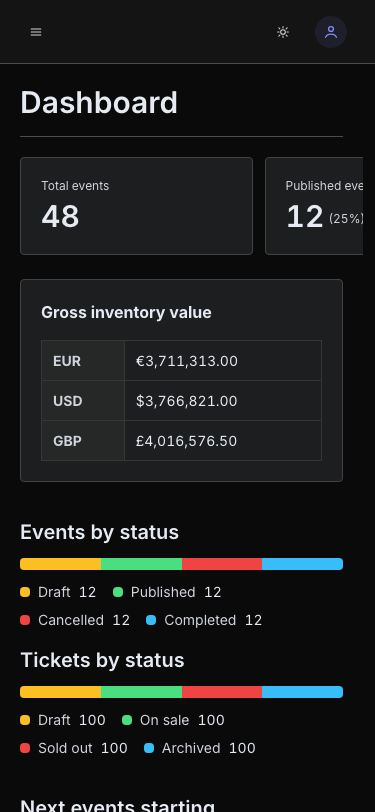

# Ticket Management Admin Portal

An administration portal for managing **Events**, **Ticket Categories** and **Tickets**,
built with Vue 3 + TypeScript, Element Plus and a fully mocked backend (MSW) — no real
server, no real database. Sign in as an administrator to create and edit events,
categories and tickets, or as a read-only viewer to browse the same data and dashboard
statistics.

## Screenshots

| | |
|---|---|
| Dashboard (light) | Dashboard (dark) |
|  |  |
| Events list (light) | Events list (dark) |
|  |  |
| Event form (light) | Event form (dark) |
|  |  |

<details>
<summary>Mobile</summary>

| Dashboard | Events list | Event form |
|---|---|---|
|  |  |  |
|  | | |

</details>

## Quick start (Docker)

The fastest way to a running app — no Node version to match.

```sh
docker compose up --build
```

The portal is then available at [http://localhost:8080](http://localhost:8080).

A multi-stage `Dockerfile` builds the production bundle and serves it with nginx. The
build stage installs from the lockfile, type-checks and builds; the runtime stage
contains only the compiled `dist/` output and nginx — no source, no `node_modules`, no
build toolchain. nginx is configured (see [`nginx.conf`](nginx.conf)) to fall back to
`index.html` for unknown paths, so refreshing a nested client-side route doesn't 404.
Hashed assets under `/assets/` are served with a long, immutable cache lifetime;
`index.html` itself is served with `Cache-Control: no-cache` so a new deploy is picked up
on the next request.

To run the image directly instead of through compose:

```sh
docker build -t ticket-admin-portal .
docker run --rm -p 8080:80 ticket-admin-portal
```

> **Note:** the Docker flow above is documented from the `Dockerfile` /
> `docker-compose.yml` / `nginx.conf` in this repository, but was **not** live-verified in
> the environment this README was written in — that sandbox has no `docker` binary
> available. Everything else in this document (installation, dev server, lint,
> type-check, both test suites, build) was executed directly and confirmed to exit `0`.

## Demo credentials

Sign in with one of the two seeded accounts:

| Role | Email | Password | Access |
|---|---|---|---|
| Administrator | `admin@platinium.test` | `admin123` | Full — read and write |
| Viewer | `viewer@platinium.test` | `viewer123` | Read-only — every write endpoint rejects this account with `403` |

The credentials are checked directly by the mock login handler
(`src/mocks/handlers/auth.ts`), not stored on the seeded user record.

## Local installation

Requires Node.js `^20.19.0 || >=22.12.0` (see [`.nvmrc`](.nvmrc), currently `20.19`).

```sh
nvm use
npm install
cp .env.example .env
```

`.env.example` currently sets `VITE_API_URL`, which configures the base URL the app's
axios client (`src/features/platform/api/client.ts`) would use — irrelevant to day-to-day
use since every request is intercepted in-browser by MSW, but present so the client has a
well-formed base URL and the variable stays documented for whoever removes the mock
layer.

Then start the dev server:

```sh
npm run dev
```

## Commands

Every script in `package.json`, grouped by purpose. Each was run from this checkout and
confirmed to exit `0` before being listed here.

**Dev**

```sh
npm run dev       # start the dev server with HMR (http://localhost:5173)
npm run preview   # serve the production build locally, after `npm run build`
```

**Quality gates**

```sh
npm run lint         # ESLint, autofix
npm run type-check   # vue-tsc --build
```

**Tests**

```sh
npm run test              # the full suite — unit + integration together
npm run test:unit         # unit suite only (--project unit)
npm run test:integration  # integration suite only (--project integration)
```

**Watch / coverage**

```sh
npm run test:watch     # watch mode; pass a path or -t <name> to target one file/test
npm run test:coverage  # coverage report, no threshold gate
```

Testing strategy, the kit's helpers and naming/location conventions: [`TESTING.md`](TESTING.md).

**Build**

```sh
npm run build    # type-check + production build (vite build)
```

## Project structure

```
.config/        Vite plugin + ESLint rule configuration
  auto-imports/           unplugin-auto-import & unplugin-vue-components
  eslint-rules/           base / stylistic / typescript / vue rule sets
  icon-names-generator/   generates the TIcons union from SVG files
  modals-generator/       auto-registers *Modal.vue files
  route-names-generator/  generates routeNames from routeNames.xxx usage
src/
  assets/styles/  Global CSS, theme, Element Plus resets
  components/     Global components (AppDataTable, ListToolbar, StatusTag,
                   CurrencyInput, RemoteSelect, illustrations, ...)
  composables/    Global composables (useListQuery, useListResource,
                   useBulkOperations, useConfirm, useTheme, ...)
  features/       Reusable, route-agnostic modules (platform/ — the typed API
                   client, icons, modal registry)
  layouts/        Layout components (AdminLayout, AuthLayout, sidebar, account menu)
  mocks/          The in-browser mock backend — MSW handlers, mock database,
                   the OpenAPI contract, chaos controls (see "Mock API" below)
  plugins/        Vue plugins
  router/         Routes, guards, generated route names
  services/       Global services (auth, notifications)
  store/          Global Pinia stores (auth)
  types/          Application-owned type definitions
  utils/          Global utilities (filters, helpers, countries)
  views/          Route-bound pages — one folder per entity (events, categories,
                   tickets, dashboard, auth, forbidden, not-found), each owning
                   its own service, routes, components and composables
tests/
  integration/    Integration tests, organised by journey
  support/        Test kit — mounting helpers, viewport, session/database seams
  setup.ts        Global Vitest setup (MSW server lifecycle)
docs/
  prd/            The ten PRDs this project was built from, plus ELEMENT-PLUS.md
  issues/         Vertical-slice issue breakdowns of each PRD
  screenshots/    The screenshots used above
  design-system.md  Design tokens, the Element Plus theme bridge, type scale,
                     motion rules and status colour mapping
```

## Architecture overview

Business logic flows in one direction only:

```
composable → store → service → apiClient
component  → (composable | store | service)
```

- **Service** — pure API/domain logic. Knows nothing about stores or composables.
- **Store** — may use services and utility composables. Created only when state is
  genuinely shared across areas.
- **Composable** — the orchestrator. May use stores and services.

**Views** are route-bound pages; **features** are reusable and route-agnostic. Features
never import from other features — views, composables and a typed event emitter
orchestrate between them.

Full rules, naming conventions and examples: [`architecture.md`](architecture.md).

## Mock API

There is no real server. Every request is intercepted in-browser by
[MSW](https://mswjs.io/) (`src/mocks/`), against handlers built from the OpenAPI contract
at [`src/mocks/openapi.yaml`](src/mocks/openapi.yaml) — the single source of truth for
every request/response shape, also used to generate the typed API client.

**Resetting the demo data.** The mock database persists to `localStorage` under the key
`platinum:mock-db` (`src/mocks/db/persistence.ts`) so state survives a page reload.
Bumping the module's `PERSISTENCE_VERSION` is the only supported way stale shapes get
discarded automatically (a version mismatch re-seeds rather than migrating). To reset the
demo data by hand for a clean walkthrough, clear that key from devtools (Application →
Local Storage → delete `platinum:mock-db`), or clear all site data, then reload.

**Forcing an API failure.** In development only (`import.meta.env.DEV`), a chaos control
surface is attached to `window.__mockChaos` (`src/mocks/chaos.ts`, wired up in
`src/mocks/browser.ts`) so error handling can be exercised without editing code:

```js
// force the next request to a route to fail
window.__mockChaos.failNextRequest({ path: '/events', status: 500 })

// force every request to a route to fail until cleared
window.__mockChaos.failPersistently({ path: '/events/:id', status: 500 })

// simulate network latency (milliseconds) on every mock response
window.__mockChaos.setLatency(1000)

// clear every forced failure and reset latency to its default
window.__mockChaos.clearChaos()
```

`path` is the handler's route pattern as registered with MSW (e.g. `/events` for the
collection, `/events/:id` for a single record) — not a concrete URL.

## Technical decisions, assumptions and trade-offs

A short summary; the full reasoning for each is in [`TECHNICAL_REVIEW.md`](TECHNICAL_REVIEW.md).

- **A local OpenAPI contract as the single source of truth** for every request/response
  shape, with a typed client generated from it.
- **In-browser MSW with server-side query semantics** (filtering, sorting, pagination
  resolved in the mock handlers) instead of a thin mock that just returns fixtures.
- **URL-driven list state** — filters, sort and pagination live in the query string, not
  component state.
- **Integer minor units for money** rather than floating-point currency values.
- **Element Plus as the component library**, not an optional extra — shared components
  wrap and configure it rather than replace it, themed through `--el-*` CSS variables
  mapped onto the design tokens. Full policy: [`docs/prd/ELEMENT-PLUS.md`](docs/prd/ELEMENT-PLUS.md);
  design tokens and the theme bridge: [`docs/design-system.md`](docs/design-system.md).

**Assumptions** — single currency per ticket, never summed across currencies; no
real-time collaboration, so two administrators editing the same record concurrently
isn't reconciled; English only, no localisation.

**Accepted trade-offs** — each argued in full in `TECHNICAL_REVIEW.md`: the session
token lives in `localStorage` rather than an httpOnly cookie, because there's no real
backend to set one; no optimistic UI updates; no Playwright end-to-end suite —
verification is a scripted browser pass, not a committed automated E2E layer; ticket
status transitions are unrestricted; dates are timezone-naive.

## Conventions worth knowing

- **Auto-imports.** Composables, services, stores, utils, components and the
  Vue/Router/Pinia/VueUse APIs are auto-imported. Do not write manual imports for them.
- **Named routes only.** `routeNames` is generated from usage; navigation never uses
  path strings.
- **Generated files** (`src/router/route-names-registry.ts`,
  `src/features/platform/api/schema.ts`, `**/icons.d.ts`, `dts/auto-imports/`) are
  never hand-edited.
- **Library first.** Check VueUse before writing a composable and Element Plus before
  building a UI primitive.

## Recommended IDE setup

[VS Code](https://code.visualstudio.com/) with the
[Vue (Official)](https://marketplace.visualstudio.com/items?itemName=Vue.volar)
extension (disable Vetur). Workspace recommendations are in
[`.vscode/extensions.json`](.vscode/extensions.json).

TypeScript cannot type `.vue` imports on its own, so `vue-tsc` replaces `tsc` for
type checking.

## AI-assisted workflow

This repository documents its own AI workflow. [`.claude/`](.claude/) contains the
skills, conventions and hooks used while building it:

- `skills/write-a-prd` — turns a requirement into a PRD
- `skills/prd-to-issues` — splits a PRD into vertical-slice issues
- `skills/code-conventions` — the enforceable rules derived from `architecture.md`
- `skills/review`, `skills/grill-me`, `skills/find-magic-numbers` — review gates
- `hooks/path-rules-reminder.sh` — surfaces path-specific rules as files are written

PRDs and issue specs live in [`docs/`](docs/). A full walkthrough of the AI-assisted
workflow lives in [`docs/ai-workflow.md`](docs/ai-workflow.md).
